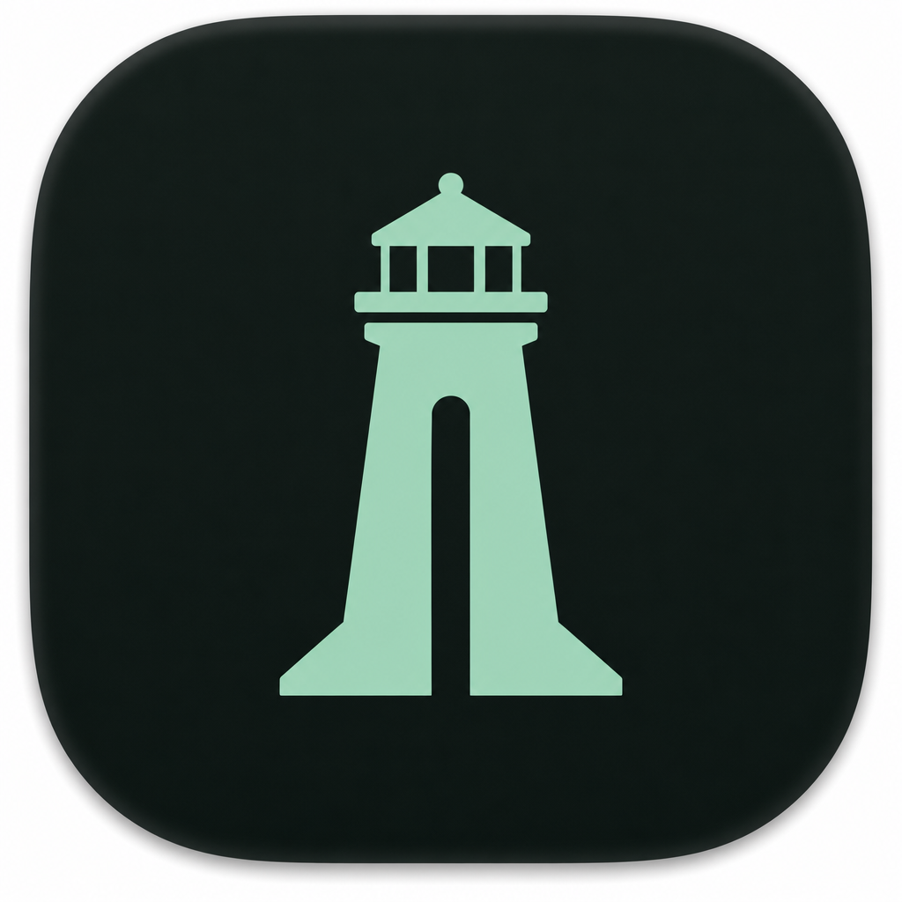

# Harbor

A macOS menu bar utility that shows every local server listening on your machine — ports, process names, and one-click open — designed to feel quiet and deliberate.



## Why

Inspired by the eternal developer wish: glance at the menu bar, see what’s running on which port, open it, move on.

## Features

- **Menu bar home** — lives in the status area; shows a live count of listening ports
- **Live discovery** — polls `lsof` every few seconds for TCP `LISTEN` sockets
- **Readable names** — resolves app display names, and smart labels for `node` / `python` scripts
- **One click to open** — click a row to open `http://localhost:<port>`
- **Context actions** — copy URL, copy port, reveal executable, terminate process
- **Hide system noise** — optional filter for `/System` and common daemon processes
- **Search** — filter by name, port, or pid

## Requirements

- macOS 14 Sonoma or later
- Xcode 16+ (the project builds in Swift 6 language mode)

## Build & run

```bash
open Harbor.xcodeproj
```

Then press **⌘R**. Harbor appears in the menu bar (no Dock icon — it’s a UIElement agent app).

Or from the command line on a Mac:

```bash
xcodebuild -project Harbor.xcodeproj -scheme Harbor -configuration Debug build
```

## Tests

Swift Testing covers `lsof` parsing, endpoint strings, process names, raw argument
boundaries, process-identity rejection, scan coalescing, last-good-list retention,
and persistent action errors. Identity/termination tests use synthetic data and
an injected signal recorder. Subprocess tests launch only disposable children
owned by the test runner to exercise large stdout/stderr output, timeouts and
cancellation; they never signal discovered user processes.

```bash
xcodebuild -project Harbor.xcodeproj -scheme Harbor -destination 'platform=macOS' test
```

The macOS GitHub Actions job clean-builds and runs this shared scheme against the
exact PR head. A green test run does not replace interactive acceptance testing:
check confirmation/cancel, repeated actions, panel-open/closed polling, settings
persistence and termination of a disposable listener on a Mac. Never use an
unrelated process as a termination test target.

## Process safety and scan failures

Termination requires a confirmed dialog, a trusted latest scan, and a stored
process identity. Harbor compares the PID, kernel start time, effective user and
executable immediately before signaling. An unreadable or changed identity
fails closed. macOS's public `kill(2)` API is PID-based, so a tiny non-atomic
check-to-signal race remains; this is not an atomic process-handle guarantee.

Discovery drains both output streams without sequential blocking reads, bounds
runtime and captured output, and cleans up its owned child on failure or
cancellation. Diagnostics and ambiguous exit results preserve the last good list
and disable termination until a successful scan. Dismissing a scan banner does
not restore trust. Action errors remain until dismissed, independently of scans.
After signaling, Harbor awaits an actual post-action scan and reports when the
process keeps listening or discovery cannot confirm the outcome.

## Design notes

Visual direction is **ink + seafoam**: deep green-black atmosphere, serif brand mark, rounded utility type for ports and metadata. The first surface is one composition — brand, status line, search, then the list. Motion is reserved for refresh, hover, and empty-state breathing.

## Project layout

```
Harbor.xcodeproj
Harbor/
├── HarborApp.swift              # MenuBarExtra entry
├── Models/
│   └── ListeningServer.swift
├── Services/
│   ├── PortScanner.swift        # observable state, polling, filtering
│   ├── PortDiscovery.swift      # lsof + libproc parsing
│   ├── ProcessIdentity.swift    # process identity + argc-bounded argv parsing
│   └── CommandRunner.swift      # bounded, cancellable subprocess execution
├── Views/
├── Theme/HarborTheme.swift      # semantic colour + metric tokens
└── Utilities/
    ├── PortActions.swift
    ├── AppIconCache.swift       # icon lookups are cached, not per-render
    └── BundlePath.swift
HarborTests/
```

## Polling

Scanning forks `lsof` and reads argv for every listening pid, so Harbor scans on
two cadences: every 2.5s while the panel is open, and every 20s once it closes.
The menu bar count stays roughly right without paying for it all day.

## Privacy

Argument parsing consumes exactly `argc` strings and preserves empty arguments.
If NUL padding after the executable makes the start of `argv[0]` ambiguous,
Harbor omits command-line metadata rather than risk reading environment values.
These rows still show the executable/process name and listening endpoint.


Harbor runs entirely on-device. It reads local process/socket metadata via `lsof` and `libproc`. Sandbox is off so process paths and command lines can be resolved. No network calls, no analytics.

## License

MIT

